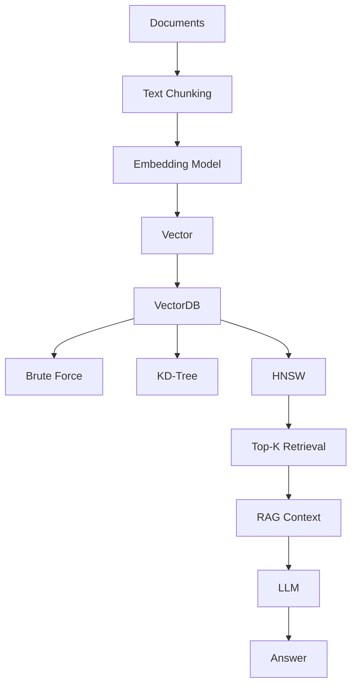

# Project Overview

VectorDB is a complete vector database implementation built from scratch in Python. It provides semantic search capabilities through three different indexing algorithms—Brute Force, KD-Tree, and Hierarchical Navigable Small World (HNSW)—along with a Retrieval-Augmented Generation (RAG) pipeline powered by local LLMs via Ollama.

The system enables efficient similarity search over high-dimensional vector representations of text, supporting both demonstration data (16-dimensional vectors across semantic categories) and real document embeddings (768-dimensional vectors from Ollama's nomic-embed-text model). A web UI provides interactive visualization of the vector space using PCA projection, benchmarking across algorithms, and a chat interface for RAG-based question answering.

# Problem Statement

Modern organizations accumulate vast amounts of unstructured information—internal documentation, knowledge bases, support tickets, research papers, product specifications, and employee handbooks. Traditional keyword search systems fail to capture semantic relationships: a search for "password reset" may miss relevant documents titled "account recovery procedures" because the exact words don't match.

Vector search addresses this by converting text into numerical embeddings that capture meaning rather than literal wording. Similar concepts are represented by nearby points in high-dimensional space, enabling systems to retrieve information based on semantic similarity rather than keyword overlap. This capability is essential for building intelligent search, recommendation, and question-answering systems.

# Proposed Solution

VectorDB implements a complete vector search pipeline from text to answers:

1. **Text Embedding**: Raw text is converted to high-dimensional vectors using an embedding model (nomic-embed-text via Ollama). Each dimension represents a semantic feature of the text.

2. **Vector Storage**: Vectors are indexed using three algorithms:
   - **Brute Force**: O(N·d) exact search through all vectors—serves as a correctness baseline
   - **KD-Tree**: O(log N) exact search using recursive space partitioning—faster for moderate dimensions
   - **HNSW**: O(log N) approximate search using a multilayer graph—production-grade for high dimensions

3. **Semantic Search**: Given a query vector, the system finds the k-nearest neighbors using the selected algorithm and distance metric (cosine similarity, Euclidean distance, or Manhattan distance).

4. **RAG Pipeline**: For question-answering, the query is embedded, relevant document chunks are retrieved, and a local LLM (llama3.2 via Ollama) generates an answer grounded in the retrieved context.

The web UI provides real-time visualization of the vector space (projected to 2D via PCA), allowing users to observe how semantic categories cluster and how different algorithms compare in performance.

# How a Company Could Use This

A company could adapt this architecture to build internal knowledge search and assistance systems:

- **Internal Knowledge Search**: Employees can search company wikis, policies, and documentation using natural language queries rather than exact keywords
- **Employee Policy Assistant**: HR questions like "What is the vacation policy?" retrieve relevant policy documents and generate answers
- **Customer Support Knowledge Retrieval**: Support agents can query a database of resolved tickets and product documentation to find similar cases
- **Product Documentation Search**: Users can search technical documentation with conceptual queries like "how to configure the database"
- **Legal Document Search**: Legal teams can find contracts or precedents based on legal concepts rather than specific clause wording
- **Technical Documentation Assistant**: Developers can search code documentation and knowledge bases using high-level concepts
- **Research Document Retrieval**: R&D teams can search internal research papers and technical reports based on research topics

The key is that the company would use their own data (documents, policies, tickets) to build company-specific embeddings, then index them in this vector database. The same RAG architecture then provides semantic search and question-answering over that proprietary data.

# Why Vector Search?

Traditional keyword search matches exact words or phrases. It cannot recognize that "account recovery" and "password reset" refer to the same concept. Vector search represents text as points in a high-dimensional space where semantically similar texts are close together.

Example:
- Query: "How can I reset my account password?"
- Keyword search might miss: "Steps to recover your account credentials"
- Vector search retrieves it successfully because the embeddings capture the semantic similarity

This enables systems to understand user intent rather than just matching literal words.

# Algorithms Used

## Brute Force

Brute force computes the distance between the query vector and every stored vector, then returns the k smallest distances. It is exact but has O(N·d) time complexity where N is the number of vectors and d is the dimensionality.

**Advantages**:
- Simple to implement and understand
- Guarantees exact results
- No indexing overhead

**Disadvantages**:
- Slow for large datasets (linear scan)
- Not scalable to millions of vectors

Brute force serves as a correctness baseline for comparing approximate algorithms.

## KD-Tree

KD-Tree recursively partitions the vector space along axis-aligned hyperplanes. Each node splits space along one dimension, cycling through all dimensions. Search prunes entire subtrees when the closest possible point in that subtree cannot beat the current best (the "ball within hyperslab" check).

**Advantages**:
- O(log N) average-case search time
- Exact results
- Effective for low-to-moderate dimensions (≤20D)

**Disadvantages**:
- Degrades with high dimensions (curse of dimensionality)
- Requires rebuilding after deletions
- Pruning becomes ineffective in high-dimensional space

KD-Tree demonstrates how spatial indexing can accelerate search but also illustrates the dimensional limitations of axis-aligned partitioning.

## HNSW

HNSW (Hierarchical Navigable Small World) builds a multilayer graph where each layer is progressively sparser. Higher layers have exponentially fewer nodes with longer-range connections, acting like a "highway" for fast traversal. Lower layers have more nodes with local connections for precise search.

**Insert Process**:
1. Randomly assign a maximum layer to the new node (exponential distribution)
2. Starting from the top layer entry point, greedily descend to the insertion level
3. At each layer from insertion level down to 0, run a beam search (ef_construction=200) to find nearest neighbors
4. Connect to M nearest neighbors bidirectionally at each layer
5. If the new node has a higher maximum layer than any existing node, it becomes the new entry point

**Search Process**:
1. Start at the top layer entry point
2. Greedily descend through upper layers with ef=1 to quickly reach the correct neighborhood
3. At layer 0, expand to ef nearest candidates using a priority queue
4. Return the top-k results

**Advantages**:
- O(log N) search time even at high dimensions
- Graph-based approach avoids the curse of dimensionality
- Used by production vector databases (Pinecone, Weaviate, Chroma)

**Disadvantages**:
- Approximate (not exact)
- More complex to implement
- Requires tuning parameters (M, ef_construction, ef)

HNSW demonstrates the graph-based approach that makes modern vector databases scalable.

# Why Three Search Algorithms?

Implementing all three algorithms serves several purposes:

1. **Educational Value**: Each algorithm illustrates a different approach to the nearest neighbor problem—linear scan, spatial partitioning, and graph-based search.

2. **Correctness Verification**: Brute force provides exact results, allowing verification that KD-Tree and HNSW produce correct or acceptable results.

3. **Performance Comparison**: The benchmark endpoint allows direct comparison of algorithm performance on the same query, illustrating trade-offs between simplicity, exactness, and speed.

4. **Dimensionality Demonstration**: Users can observe how KD-Tree performance degrades at high dimensions while HNSW remains effective, demonstrating the curse of dimensionality.

In a production setting, a company would typically use only HNSW (or a similar graph-based algorithm) for high-dimensional embeddings. The inclusion of all three here is for educational and comparative purposes.

# RAG Pipeline

The Retrieval-Augmented Generation pipeline enables question-answering over stored documents:

1. **User Question**: The user asks a natural language question
2. **Query Embedding**: The question is converted to a vector using the embedding model
3. **Vector Search**: HNSW retrieves the k most semantically similar document chunks
4. **Context Construction**: Retrieved chunks are formatted as context for the LLM
5. **Answer Generation**: The LLM generates an answer grounded in the retrieved context
6. **Response**: The answer is returned to the user along with the retrieved context for transparency

This approach ensures answers are based on the actual stored documents rather than the LLM's training data, making it suitable for domain-specific or proprietary information.

# Tech Stack

| Technology | Purpose | Why Used |
|------------|---------|----------|
| Python | Implementation language | Clear data structures, strong numerical computing support, extensive library ecosystem |
| FastAPI | REST API framework | Fast, modern, automatic OpenAPI documentation, async support |
| Uvicorn | ASGI server | Production-grade server for FastAPI applications |
| Requests | HTTP client | Simple library for making HTTP requests to Ollama API |
| Ollama (nomic-embed-text) | Embedding model | Local embedding model, no API keys required, 768-dimensional vectors |
| Ollama (llama3.2) | Language model | Local LLM for RAG, no API keys required, runs on consumer hardware |
| HTML/CSS/JavaScript | Web UI | Frontend for interactive visualization and user interaction |
| Canvas API | Visualization | Browser-native 2D graphics for PCA scatter plot |

# Why Each Technology Was Used

**Python**: Python provides clear, readable data structures and strong support for numerical computing. The language's simplicity makes the algorithm implementations easy to understand and explain, which is valuable for educational purposes and interviews.

**FastAPI**: FastAPI is a modern, high-performance web framework for building APIs with Python. It provides automatic data validation, serialization, and OpenAPI documentation. It's well-suited for exposing the vector search and RAG functionality through REST endpoints.

**Uvicorn**: Uvicorn is a lightning-fast ASGI server implementation that runs FastAPI applications. It's production-ready and handles concurrent requests efficiently.

**Requests**: The requests library provides a simple, human-friendly API for making HTTP requests. It's used to communicate with the Ollama API for embeddings and text generation.

**Ollama (nomic-embed-text)**: This embedding model runs locally via Ollama, eliminating the need for external API keys or cloud services. It produces 768-dimensional vectors that capture semantic meaning effectively. Running locally ensures privacy and reduces latency.

**Ollama (llama3.2)**: This language model runs locally via Ollama, enabling RAG without external dependencies. It's capable of generating coherent answers based on provided context. Running locally ensures that proprietary documents are not sent to external services.

**HTML/CSS/JavaScript**: These standard web technologies provide a cross-platform frontend. The single-page application communicates with the backend via REST APIs, offering an interactive user interface for all features.

**Canvas API**: The HTML5 Canvas API provides browser-native 2D graphics capabilities. It's used to render the PCA scatter plot visualization without requiring external visualization libraries.

# Architecture

The architecture demonstrates the complete flow from raw documents to semantic search and question-answering. Documents are chunked, embedded, and indexed in the vector database. Three different indexing algorithms are available for search. For RAG, retrieved chunks are provided as context to the LLM, which generates an answer.

# Project Flow

**Demo Vector Search**:
1. User enters a query (e.g., "binary tree")
2. Frontend converts query to 16D embedding using keyword matching
3. Backend searches the vector database using selected algorithm (HNSW/KD-Tree/Brute Force)
4. Results are returned with distances and metadata
5. Frontend displays results and updates PCA visualization

**Document Insertion**:
1. User provides title and text
2. Backend chunks the text (250 words with 30-word overlap)
3. Each chunk is sent to Ollama for embedding (768D vector)
4. Each chunk is inserted into DocumentDB (HNSW index)
5. A 16D visualization vector is also inserted for the scatter plot

**RAG Question-Answering**:
1. User asks a question
2. Question is embedded via Ollama (768D)
3. HNSW retrieves top-k similar document chunks
4. Retrieved chunks are formatted as context
5. Context + question are sent to Ollama LLM
6. LLM generates an answer
7. Answer and context are returned to the user

# Key Engineering Concepts Demonstrated

- **Vector Representations**: Converting text to numerical embeddings that capture semantic meaning
- **Nearest-Neighbor Search**: Finding the k most similar vectors in high-dimensional space
- **Indexing**: Data structures (trees, graphs) that accelerate search operations
- **Graph-Based Search**: Navigating a multilayer graph for approximate nearest neighbors
- **Dimensionality Reduction**: PCA projection for visualizing high-dimensional data in 2D
- **Embeddings**: Using neural network models to generate vector representations of text
- **Semantic Search**: Retrieving information based on meaning rather than keywords
- **RAG (Retrieval-Augmented Generation)**: Combining retrieval with generation for question-answering
- **REST APIs**: Exposing functionality through standardized HTTP endpoints
- **Concurrency**: Thread-safe data structures for concurrent access

# Limitations

This is an educational implementation intended to demonstrate the core concepts of vector databases and RAG. Several limitations should be noted:

- **Educational Implementation**: The HNSW and KD-Tree implementations are simplified compared to production-grade vector databases (Pinecone, Weaviate, Milvus). They lack optimizations like dynamic ef adjustment, persistence, and advanced pruning strategies.

- **In-Memory Storage**: All data is stored in memory. There is no persistence to disk, so data is lost when the server restarts.

- **Single-Threaded Search**: While data structures are thread-safe, search operations are not parallelized. Production systems often use multi-threaded or distributed search.

- **Scalability**: The implementation is not designed for millions of vectors. Performance characteristics at scale have not been tested.

- **No Metadata Filtering**: The system does not support filtering results by metadata fields (e.g., "search only documents from 2023").

- **No Deletion Optimization**: KD-Tree requires rebuilding after deletions, which is O(N log N). Production systems use more sophisticated deletion handling.

- **LLM Performance**: The local LLM (llama3.2) runs on CPU, which can be slow (10-30 seconds per answer) depending on hardware. GPU acceleration would significantly improve performance.

- **No Streaming**: LLM responses are generated entirely before being returned, rather than streaming tokens as they are generated.

# Future Improvements

Realistic improvements that could enhance this system:

- **Persistence**: Add disk-based storage for vectors and graph structures using a database or serialization format.

- **Metadata Filtering**: Implement metadata-aware search that can filter results by fields like date, category, or author.

- **Distributed Indexing**: Partition the vector index across multiple machines for horizontal scalability.

- **Better Benchmarking**: Add more comprehensive benchmarking with varying dataset sizes, dimensions, and query patterns.

- **Production-Grade Concurrency**: Implement thread-pool based parallel search for improved throughput.

- **Streaming Responses**: Stream LLM responses token-by-token for better user experience.

- **GPU Acceleration**: Add support for GPU-accelerated embeddings and LLM inference.

- **Advanced HNSW Features**: Implement dynamic ef adjustment, heuristic pruning, and other optimizations used in production HNSW implementations.

- **Incremental KD-Tree Updates**: Implement more efficient deletion/update mechanisms for KD-Tree to avoid full rebuilds.

- **Vector Quantization**: Add support for product quantization or other compression techniques to reduce memory usage and improve cache efficiency.

These improvements would move the system from an educational demonstration toward a production-ready vector database.
